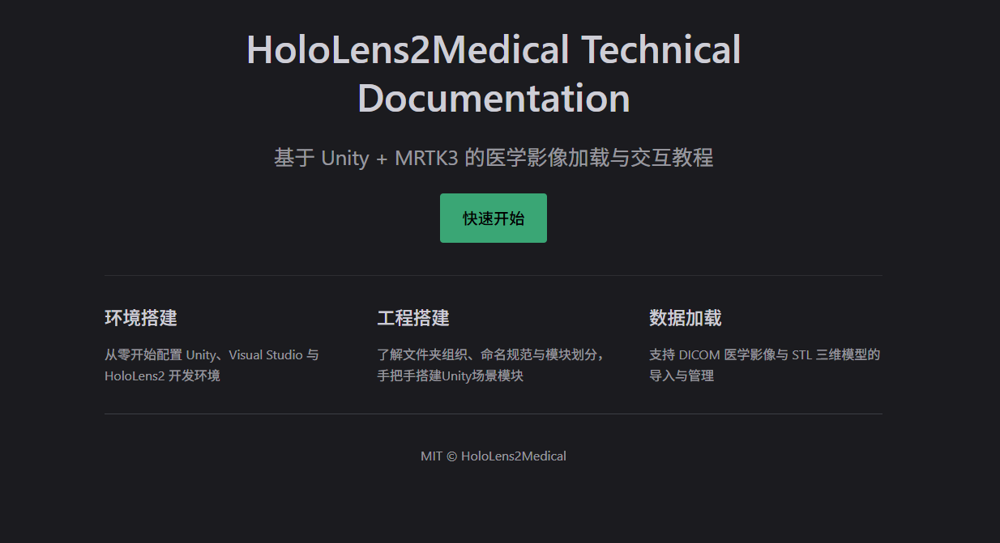
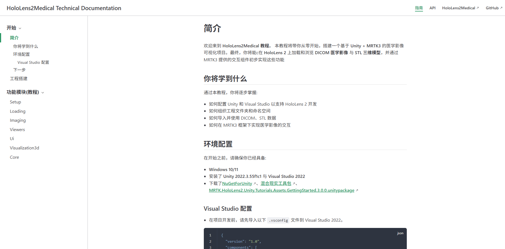

# HoloLens2Medical 技术文档

本项目为 HoloLens2Medical 提供完整的技术文档，采用 VuePress 构建，涵盖 DICOM 医学影像处理、MRTK3 交互集成以及 Unity 开发的全套技术说明。
* 
* 
## 关于 HoloLens2Medical 项目

HoloLens2Medical 是一个基于 Unity 和 MRTK3 的医学影像可视化解决方案，专为 HoloLens 2 设备设计。项目实现了以下核心功能:

- **DICOM 医学影像加载与显示**:支持批量加载 DICOM 文件，实现多平面重建（MPR）
- **STL 三维模型导入**:集成 STL 模型显示与交互
- **MRTK3 交互集成**:提供手势控制、语音命令等混合现实交互
- **多平面重建查看器**:支持轴向、矢状、冠状三个解剖平面的同步浏览
- **窗宽窗位调节**:实时调整医学影像的对比度和亮度
- **三维可视化**:在 3D 空间中展示切片平面，支持显隐控制

## 文档结构

本技术文档按照模块化架构组织，主要包含:

### 指南部分（Guide）
- **工程搭建**:环境配置、依赖安装、项目初始化
- **Loading 模块**:DICOM 数据加载、索引解析、异步处理
- **Imaging 模块**:图像处理、纹理缓存、多平面重建
- **Viewers 模块**:界面查看器、事件处理、用户交互
- **UI 模块**:MRTK3 界面控制、事件绑定、状态同步
- **Visualization3D 模块**:三维可视化、纹理桥接、平面控制
- **Core 模块**:核心数据结构、坐标映射、基础功能

### API 参考（Reference）
- 完整的类和方法 API 说明
- 接口定义和参数描述
- 使用示例和最佳实践

每个模块包含两个核心部分:
- **原理解读（Explanations）**:架构设计、实现原理、技术思路
- **实现细节（Implementation）**:具体技术实现、性能优化、问题解决

## 环境要求

### 开发环境
- **Node.js**:v22.18.0
- **Yarn**:推荐使用 Yarn 作为包管理器

## 安装指南

### 1. 克隆项目

```bash
git clone https://github.com/101AoiKoori/HoloLens2Medical-Technical-Documentation_VuePress.git
cd HoloLens2Medical-Technical-Documentation_VuePress
```

### 2. 安装依赖

```bash
yarn install
```

### 3. 启动开发服务器

```bash
yarn docs:dev
```

服务器启动后，在浏览器中访问 `http://localhost:8080` 查看文档。

### 4. 构建生产版本

```bash
yarn docs:build
```

构建完成的静态文件将位于 `docs/.vuepress/dist` 目录中。

## 项目结构

```
├── docs/                    # 文档源文件
│   ├── .vuepress/          # VuePress 配置
│   │   └── config.js       # 站点配置
│   ├── guide/              # 指南文档
│   │   ├── 00setup/        # 工程搭建
│   │   ├── 01loading/      # Loading 模块
│   │   ├── 02imaging/      # Imaging 模块
│   │   ├── 03viewers/      # Viewers 模块
│   │   ├── 04ui/           # UI 模块
│   │   ├── 05visualization3d/ # Visualization3D 模块
│   │   └── 06core/         # Core 模块
│   ├── reference/          # API 参考
│   └── README.md           # 首页
├── package.json            # 项目配置
└── README.md               # 项目说明
```
---