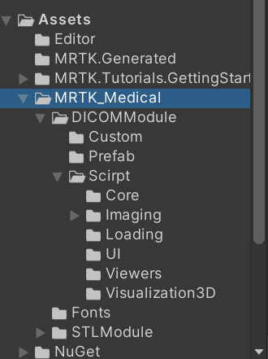
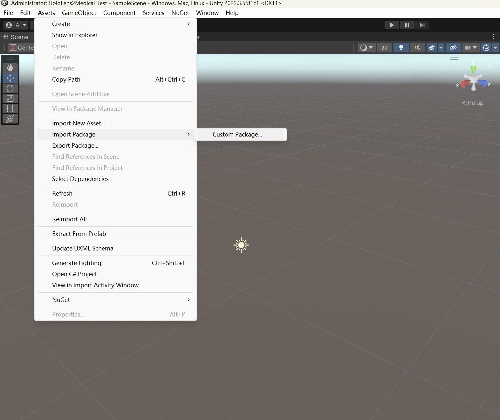
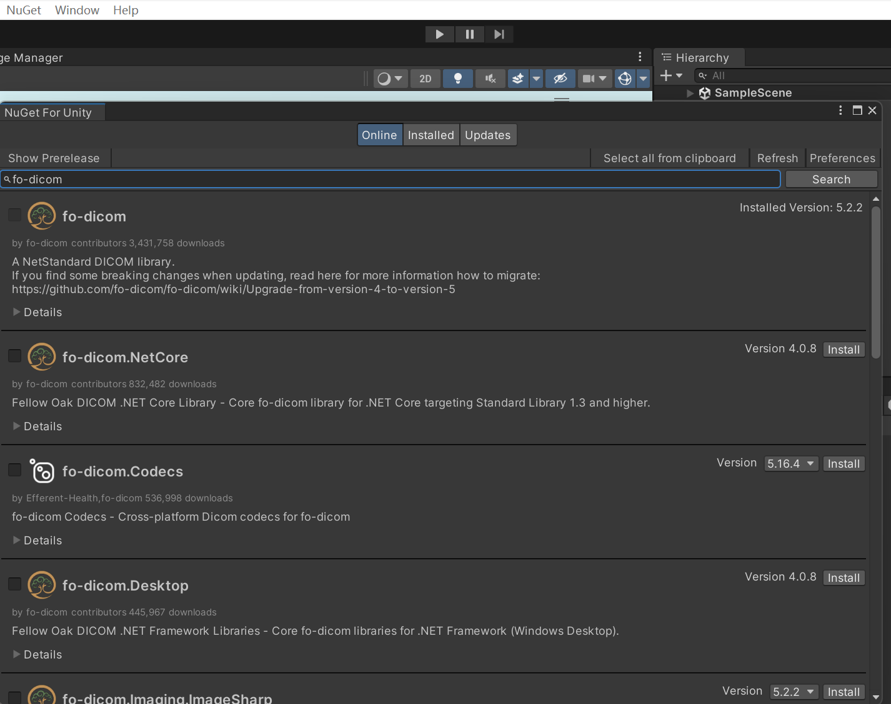
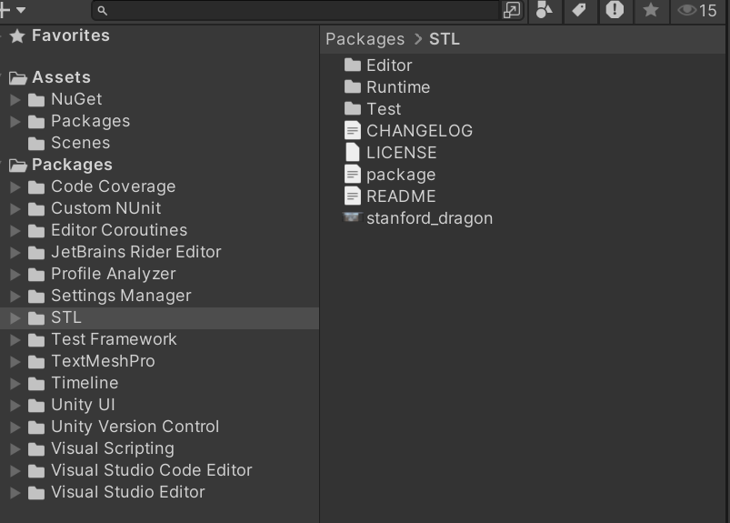
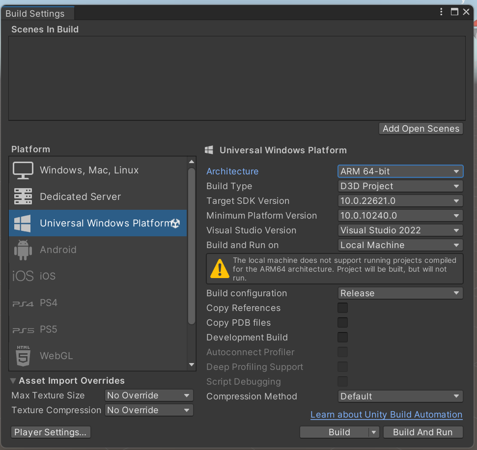
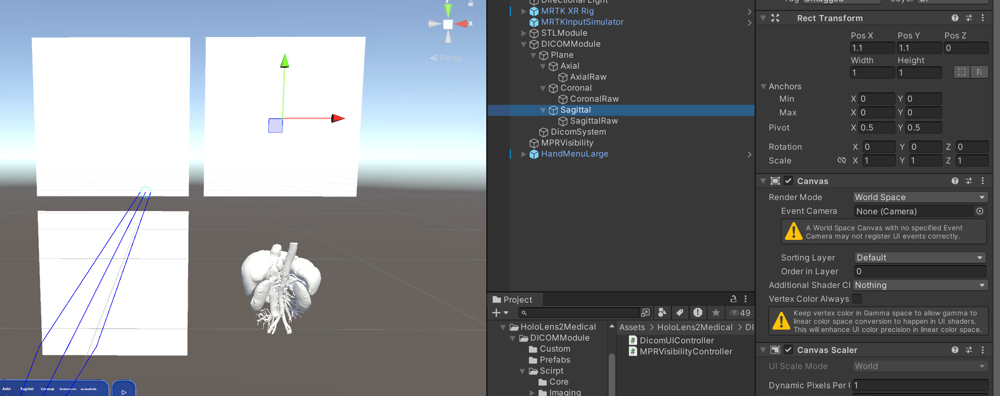
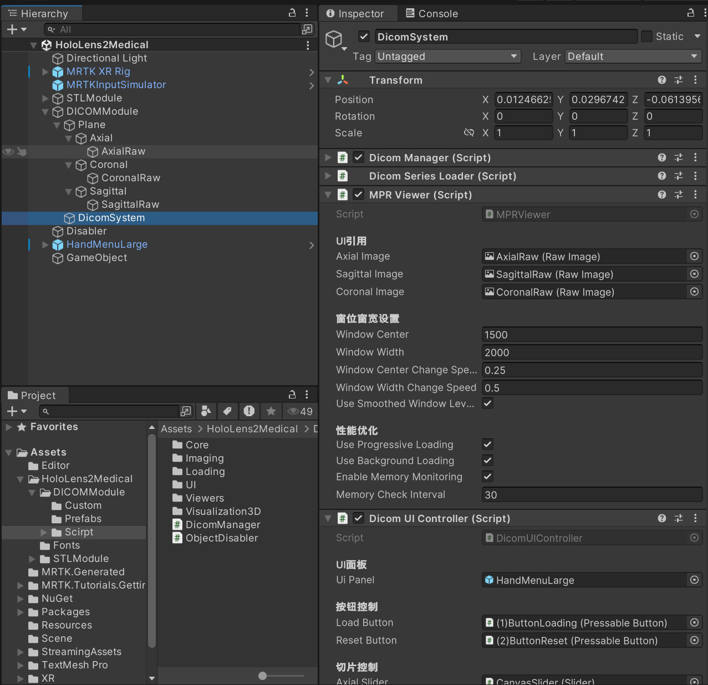
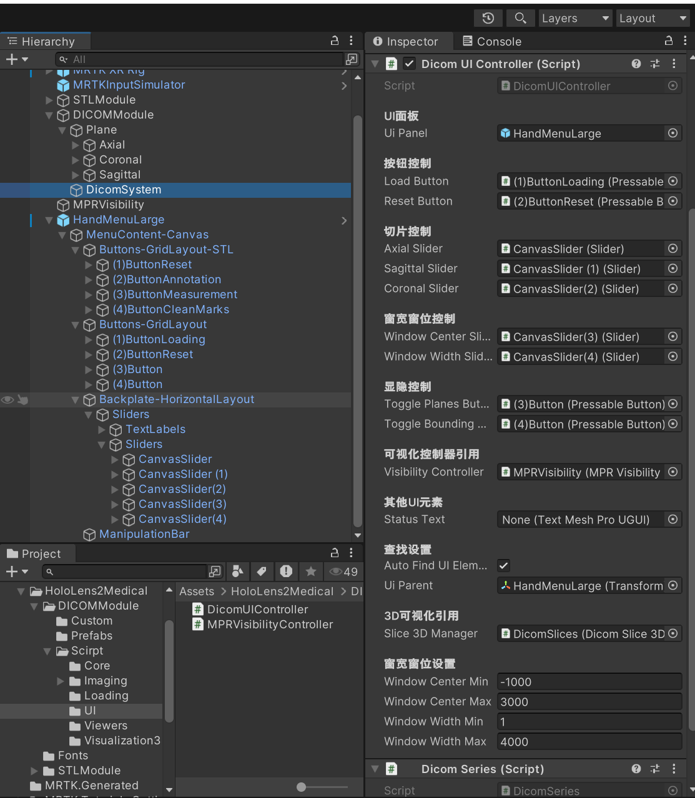
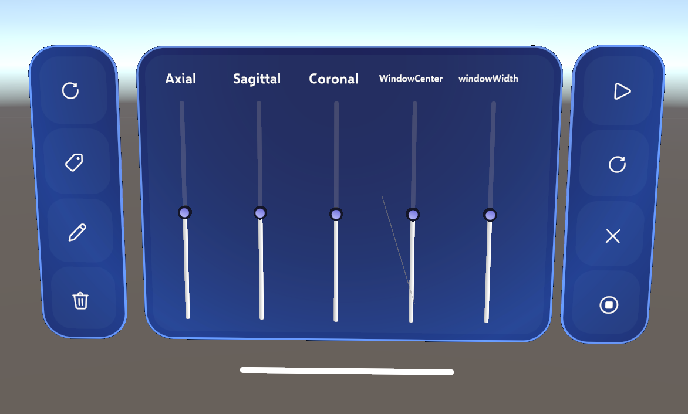

# 工程搭建
---

> 目标：完成一个可在 **HoloLens 2** 运行的 Unity 工程骨架，能加载 DICOM / STL，并用 **MRTK3** 交互浏览。

## 1. 建立工程与基础目录

1. 使用 **Unity 2022 LTS**(推荐 Unity 2022.3.55f1c1)新建 3D 项目，项目名：`HoloLens2Medical`
2. 在 `Assets/` 下创建目录：

```json
Assets/
├──HoloLens2Medical
|   ├── DICOMModule/
|   │   ├── Custom/ //放置着色器文件
|   │   ├── Prefab/ //放置预制件
|   |   └── Scirpt/ //放置脚本
|   |       ├── Core/
|   │       ├── Loading/
|   │       ├── Imaging/
|   │       ├── Viewers/
|   |       ├── UI/
|   │       └── Visualization3D/
```


> 命名建议：统一使用命名空间 `MedicalMR.DICOM.<Module>`例如：`MedicalMR.DICOM.Core`。
---

## 2. 安装第三方包
### 2.1  安装MRTK3环境
* MRTK3、XR环境配置在官方文档:[Mixed Reality Feature Tool](https://learn.microsoft.com/en-us/windows/mixed-reality/develop/unity/welcome-to-mr-feature-tool)和Hololens2官方教程：[HoloLens 2 fundamentals: develop mixed reality applications](https://learn.microsoft.com/en-us/training/paths/beginner-hololens-2-tutorials/)中已有详细介绍，本文不再描述。
### 2.2 安装fo-dicom第三方包
1. 在Unity中通过 Assets 导入 NuGet 的 NuGetForUnity 包

2. 导入完成后在`NuGet`的`Manage NuGet Packages`中搜索`fo-dicom`并下载5.2.2版本的第三方包

3. 在创建的C#脚本中导入`using FellowOakDicom`包，没有报错即为成功
### 2.3 安装pb_Stl第三方包
1. 下载`pb_Stl`：[pb_Stl](https://github.com/karl-/pb_Stl)，将文件放入根目录的Packages里
2. 打开`Packages/manifest.json`，添加`"co.parabox.stl":"https://github.com/karl-/pb_Stl.git" to the "dependencies"`到列表中
3. 在Packages中看到`STL`即为成功

---

## 3. Unity 平台与 UWP 配置

### 3.1 切换平台

* **File > Build Settings…** → 选择 **Universal Windows Platform** → `Switch Platform`

  * Architecture：**ARM 64-bit**
  * Target SDK Version：**10.0.22621.0**



## 4. 预制件与场景层级(Hierarchy)

### 4.1 数据与资源放置
* 在 `Assets/HoloLens2Medical/DICOMModule/Prefabs/`中可以找到已经配置好的预制件。
* 请将`dicom`数据放置在`Assets\StreamingAssets\DICOM`中，请先清除`StreamingAssets`中的`json`文件后再尝试加载`dicom`;

```
Assets/StreamingAssets/
└── DICOM/
    ├── series-index.json
    └── <你的 dcm 文件/子目录>
```
* 请将着色器文件放置在`DICOMModule/Custom`中

### 4.2 场景层级(Hierarchy)搭建
>由于visualization3d模块是STL模型与DICOM数据交互模块的融合，因此在属于STL的层级结构中会出现DICOM的相关脚本

1. 首先，在场景中创建一个空对象并命名为 **`DICOMModule`**。
在该对象下，再创建一个名为 **`Plane`** 的主空对象，用于承载各个视图。
然后，在 `Plane` 下分别建立三个Canvas，代表不同切面：**轴位 (Axial)**、**冠状位 (Coronal)**、**矢状位 (Sagittal)**。
最后，在每个切面对象下添加一个 Unity 自带的 **Raw Image** 组件(宽高均为 1 个单位)，并分别命名为：

* `AxialRaw`
* `CoronalRaw`
* `SagittalRaw`
>三个`Canvas`的`Render mode`设置为`World Space`,宽高均设为1，如图所示即可


2. 再回到`DICOMModule`空对象里，在它的子级下创建一个名为`DicomSystem`的脚本挂载对象，
将`Assets/HoloLens2Medical/DICOMModule/Script`中的`DicomManager`挂载上去。
* `DicomManager`会自动挂载上`DicomSeriesLoader`、`DicomUIController`、`MPRViewer`这三个组件


3. 接下来需要配置`MPRViewer`、`DicomUIController`这两个组件。
* 首先将`Prefabs`中的`HandMenuLarge`放置到在场景层级中，有可能`HandMenuLarge`离`MRTK3`的`MRTK XR Rig`有些远，请将面板拖到摄像头可见范围内。
* 接下来在`MPRViewer`中将刚刚创建的3个`Raw image`拖入UI引用中(如上图所示)，在MPRViewer中可以调整窗位和窗宽的初始位置、步幅。


* 接下来在`DicomUIController`组件中依次放入`HandMenuLarge`预制件，`HandMenuLarge`右侧的按钮、滑条,具体配置如图所示
* `HandMenuLarge`预制件包括了3个部分，左侧为基础`MRTK3`交互模块，从上到下的功能是：**重置STL模型位置**、**标记模式**、**测距模式**、**清除标记和线条**;右侧是`DICOM`数据交互模块，从上到下分别是：**加载`DICOM`数据**、**重置视图**、**隐藏3D模块平面**、**关闭`STL`模型外框`BoxCollider`** 


4. 放置好DICOM数据文件以及完成如上的配置后，就可以正常加载dicom数据了。

### 4.3 STL模块配置
1. 

### 4.4推荐的场景层级模板：

```
DICOMModule
 ├─ Plane
 │   ├─ Axial       (轴位 Canvas，下挂 Raw Image：AxialRaw)
 │   │   └─ AxialRaw (Raw Image, 1×1 单位)
 │   ├─ Coronal     (冠状位 Canvas，下挂 Raw Image：CoronalRaw)
 │   │   └─ CoronalRaw (Raw Image, 1×1 单位)
 │   └─ Sagittal    (矢状位 Canvas，下挂 Raw Image：SagittalRaw)
 │       └─ SagittalRaw (Raw Image, 1×1 单位)
 ├─ DicomSystem     (DicomSeries、DicomTextureBridge 等核心脚本挂载)
 └─ MPRVisibility   (多平面可视化开关控制)

```

---
## 5. 下一步

* 进阶：前往 **“数据加载(how-to)”** 学习 DICOM 索引与流式读取
* 进阶：前往 **“原理解读(explanations)”** 了解窗宽窗位/体绘制/Shader 管线
* 最终：**Build & Deploy** 到 HoloLens 2 进行实机测试
---
